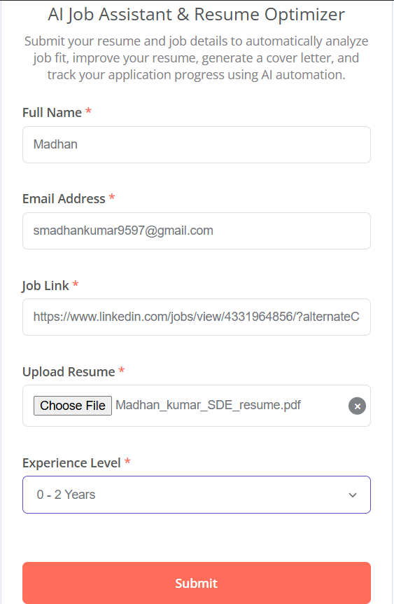

# AI-Powered Job Application Automation System

An automated n8n workflow that analyzes your resume against a job description,
scores the match, identifies skill gaps, and generates a tailored cover letter —
all delivered to your inbox automatically.

## 🚀 How It Works

1. User fills a form with name, email, job URL, resume (PDF), and experience level
2. Resume is extracted and job description is scraped from the URL
3. Google Gemini AI analyzes the match and scores it
4. Skill gaps and resume improvement suggestions are identified
5. A personalized cover letter is generated
6. Everything is saved to Google Sheets and emailed to the user

## 🛠️ Tech Stack

- **n8n** – Workflow automation
- **Google Gemini** – AI analysis & cover letter generation
- **Google Sheets** – Application tracking
- **Gmail** – Automated email delivery

## 📸 Workflow Preview

### Submission Form

### n8n Workflow

### Google Sheets Output

### Email Report

